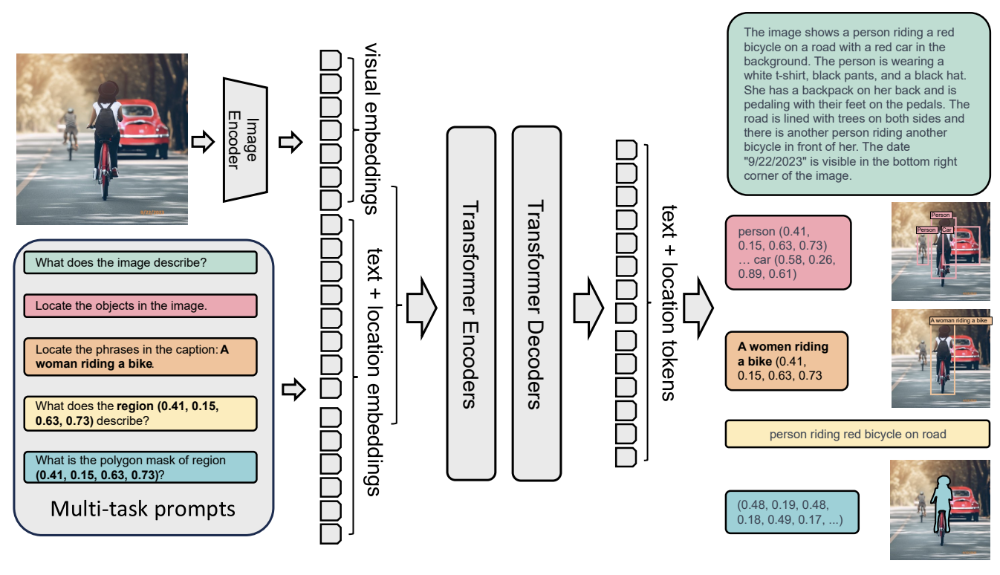

# Fine-tuning Florence-2 - Microsoft's Cutting-edge Vision Language Models
Florence 2, released by Microsoft in June 2024, is a foundation vision-language model. This model is very attractive because of its small size (0.2B and 0.7B) and strong performance on a variety of computer vision and vision-language tasks.



Florence supports captioning, object detection, OCR, and more out of the box. However, your task might not be supported, or you might need to control the model's output for your task. That's when you will need to fine-tune the model.

In this repository, we present code to fine tune Florence-2-large-ft on [DocVQA](https://www.docvqa.org/).
In case you want a quick play with data, visit https://huggingface.co/datasets/zhangfaen/DocumentVQA/ 

Note: Florence-2-large-ft is already a SFT version of Florence-2-large (https://huggingface.co/microsoft/Florence-2-large). In this repo, we continue fine-tuning Florence-2-large-ft to make it have new skills.

## Installation
To get started, run the following commands:

```bash
conda create -n florence2-finetuning python=3.11 -y
conda activate florence2-finetuning
git clone https://github.com/zhangfaen/finetune-Florence-2-large-ft
cd finetune-Florence-2-large-ft
pip install -r requirements.txt
```

If you encounter issues with flash-attn, you can fix it with the following command:

```bash
pip install -U flash-attn --no-build-isolation
```

## Get the data

For this experiment, we use the DocumentVQA dataset. 
```python
from datasets import load_dataset

data = load_dataset('zhangfaen/DocumentVQA')
# zhangfaen/DocumentVQA dataset is a snapshot of 'HuggingFaceM4/DocumentVQA' from huggingface , in case in future huggingface team deletes/changes it, we make a copy.

print(data)
```

Output:

```python
DatasetDict({
    train: Dataset({
        features: ['questionId', 'question', 'question_types', 'image', 'docId', 'ucsf_document_id', 'ucsf_document_page_no', 'answers'],
        num_rows: 39463
    })
    validation: Dataset({
        features: ['questionId', 'question', 'question_types', 'image', 'docId', 'ucsf_document_id', 'ucsf_document_page_no', 'answers'],
        num_rows: 5349
    })
    test: Dataset({
        features: ['questionId', 'question', 'question_types', 'image', 'docId', 'ucsf_document_id', 'ucsf_document_page_no', 'answers'],
        num_rows: 5188
    })
})
```

## Florence-2-large-ft for Fine-Tuning

We have put Florence-2-large-ft modeling files under dir_of_this_repo/model/
We still need a Florence-2-large-ft model checkpoint, run below bash commands to get it:

```bash
# in root dir of this repo
cd model
wget https://huggingface.co/zhangfaen/Florence-2-large-ft-checkpoint/resolve/main/pytorch_model.bin
mv pytorch_model.bin pytorch_model.by.microsoft.bin
```

Then we can use below python code to load Florence-2-large-ft model checkpoint
```python
# Below line will load ./model/pytorch_model.by.microsoft.bin
model = AutoModelForCausalLM.from_pretrained("./model", trust_remote_code=True, variant="by.microsoft").to(device)
```

## Single GPU training

To train with just one GPU, you can simply run:

```bash
python train.py
```

It will automatically train on the DocumentVQA dataset.

## Distributed training

The `distributed_train.py` script allows you to train the Florence-2 model using distributed data parallelism, which can significantly speed up the training process when using multiple GPUs. Below are the steps to use this script:

```bash
python distributed_train.py
```

## Play with our fine-tuned model and compare with the original model from microsoft
check out playground.ipynb

## Acknowledgement
This repo is built based on 
- https://huggingface.co/datasets/HuggingFaceM4/DocumentVQA
- https://huggingface.co/microsoft/Florence-2-large 
- https://github.com/andimarafioti/florence2-finetuning  

Many thanks to them for the great model/data/code!

